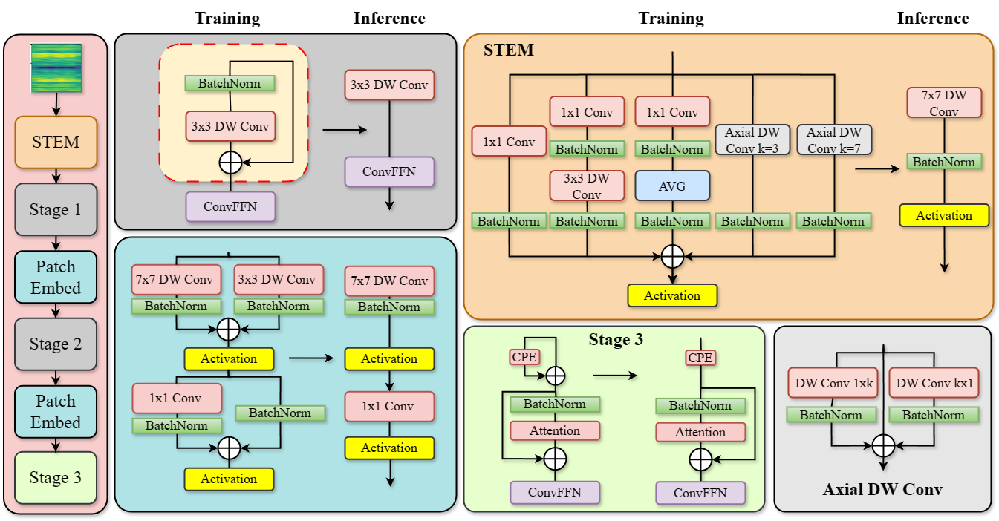

# A Bearing Fault Diagnosis Framework Based on Few-Shot Learning with Distribution Consistency and Structural Reparameterization

This is our implemented source code for the paper "[A Bearing Fault Diagnosis Framework Based on Few-Shot Learning with Distribution Consistency and Structural Reparameterization](https://link.springer.com/chapter/10.1007/978-3-031-76197-3_14?fbclid=IwY2xjawHWLUdleHRuA2FlbQIxMAABHXh-wWgqxGsvqpThkMs1EzZL5eM_bhlo0lZbSFYjfIeX2Yce0VH5u4wPEA_aem_gNb2HGH12E5usjY4AJRLVA)" accepted by International Conference on Green Technology and Sustainable Development 7th
## Methodology


## Environment
```bash 
conda create -n BEARING python=3.10.12 -y
conda activate BEARING
pip install --upgrade pip
pip install -r requirements.txt
```

## Dataset
[CWRU Download Link](https://engineering.case.edu/bearingdatacenter)


## Getting Started
### Installation

``` bash
git clone https://github.com/giabao804/few-shot-structural-rep.git
cd few-shot-structural-rep
```

### Training
```bash
chmod +x train.sh
```
- 1-shot training

```bash
bash train.sh 1 
```
- 5-shot training
```bash
bash train.sh 5
```

### Testing

```bash
chmod +x test.sh
```
- 1-shot testing
```bash
bash test.sh 1 
```
- 5-shot testing
```bash
bash test.sh 5
```

## Contact
Please feel free to contact me via email bao.tg212698@sis.hust.edu.vn or giabaotruong.work@gmail.com if you need anything related to this repo!
## Citation
If you feel this code is useful, please give us 1 ⭐ and cite our paper.
```bash
@inproceedings{truong2024bearing,
  title={A Bearing Fault Diagnosis Framework Based on Few-Shot Learning with Distribution Consistency and Structural Reparameterization},
  author={Truong, Gia-Bao and Than, Nhu-Linh and Vu, Manh-Hung and Pham, Van-Truong and Nguyen, Thi-Hue and Tran, Thi-Thao},
  booktitle={International Conference on Green Technology and Sustainable Development},
  pages={162--172},
  year={2024},
  organization={Springer}
}

```


